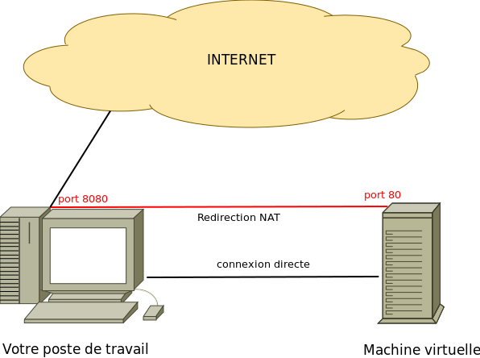

Introduction
============

Ce guide d'introduction est écrit en français, mais ne vous y habituez pas trop,
les sujets de TPs sont écrits en anglais.

* [La Machine Virtuelle](#la-machine-virtuelle)
  * [Installation](#installation)
  * [Démarrage](#d%C3%A9marrage)
  * [Arrêt](#arr%C3%AAt)
  * [Accès SSH](#acc%C3%A8s-ssh)
  * [Dossiers Partagés](#dossiers-partag%C3%A9s)
  * [Problèmes Rencontrés](#probl%C3%A8mes-rencontr%C3%A9s)
* [Guide de survie avec Git](#guide-de-survie-avec-git)
* [Guide de survie avec `vi`](#guide-de-survie-avec-vi)

Vous allez utiliser une **machine virtuelle** préconfigurée avec
[Puppet](http://puppetlabs.com/). On parle également de "VM" pour désigner une
machine virtuelle, acronyme de l'anglais **V**irtual **M**achine.

Cette machine inclut tout le necessaire pour faire fonctionner vos TPs et
comporte les programmes suivants :

* PHP 5.5
* Apache2
* MySQL
* Git
* et divers outils

La Machine Virtuelle
--------------------

Tous les TPs se dérouleront dans une machine virtuelle _headless_, c'est-à-dire
sans interface graphique.
Cette machine est pilotée par [Vagrant](http://www.vagrantup.com), un programme
en ruby qui abstrait la configuration et la manipulation de la machine.

Tout se passe comme si la machine virtuelle était un serveur accessible
uniquement en réseau, via un tunnel `ssh`.

Votre machine redirige toutes les connexions entrantes sur le port `8080` vers
le port `80` de la machine virtuelle. Pareil pour les ports `8081` et `8082` qui
redirigent respectivement vers les ports `81` et `82` de la machine virtuelle.

### Installation

Vous allez installer la configuration de Vagrant dans le répertoire
`/usr/local/licphp/workspace/vm-$USER`.

Dans la suite du document, nous utiliserons `DOCROOT` pour parler de ce chemin.

Pour faciliter la suite, vous êtes invité à définir une variable d'environnement :

    $ export DOCROOT="/usr/local/licphp/workspace/vm-$USER"

Vous pouvez ajouter cette ligne à votre fichier `.bashrc`.

Maintenant, récupérez la configuration de la machine virtuelle :

    $ git clone git://github.com/licpro/php-vm.git --recursive $DOCROOT
    $ cd $DOCROOT

En listant le répertoire, vous devez avoir une sortie similaire à celle-ci :

    DOCROOT $ ls -la

    total 32
    drwxr-xr-x  12 william  staff   408B  6 jan 15:41 ./
    drwxr-xr-x   9 william  staff   306B  4 jan 16:17 ../
    drwxr-xr-x  16 william  staff   544B  6 jan 09:35 .git/
    -rw-r--r--   1 william  staff    20B  4 jan 14:55 .gitignore
    drwxr-xr-x   3 william  staff   102B  6 jan 15:41 .vagrant/
    -rw-r--r--   1 william  staff   2,1K  4 jan 16:11 README.md
    -rw-r--r--   1 william  staff   1,7K  6 jan 02:01 Vagrantfile
    drwxr-xr-x   3 william  staff   102B  1 jan 19:18 files/
    -rw-r--r--   1 william  staff   111B  1 jan 19:18 hiera.yaml
    drwxr-xr-x   7 william  staff   238B  6 jan 15:49 projects/
    drwxr-xr-x   5 william  staff   170B  1 jan 19:18 puppet/
    drwxr-xr-x   7 william  staff   238B  1 jan 19:18 shell/

La configuration est située dans le fichier `Vagrantfile` et la recette
d'installation du serveur est située dans le dossier `puppet/manifests/`.

Pour terminer l'installation de la machine virtuelle, lancer la commande
suivante :

    $ vagrant up

Ouvrir un navigateur, et aller à l'adresse `http://localhost:8080/` pour
vérifier que tout fonctionne.

### Démarrage

    $ vagrant up

Oui, c'est bien la même commande que pour installer la machine virtuelle. En
fait, cette commande est toujours celle qui permet d'utiliser la VM, qu'elle
soit déjà installée ou non. Il est inutile d'avoir deux commandes pour obtenir
le même résultat, ce que l'on veut au bout du compte, c'est pouvoir utiliser la
VM.

### Arrêt

    $ vagrant halt

_Note :_ Merci de bien éteindre la machine virtuelle à la fin de la séance.

### Accès SSH

    $ vagrant ssh

Une fois dans la machine virtuelle, vous pouvez prendre les droits `root` via
`sudo`, mais est-ce bien utile ? :-)

### Dossiers Partagés

Des dossiers sont partagés entre votre machine et la machine virtuelle. Vous
trouverez le détail complet ici :
[https://github.com/willdurand-edu/php-vm#filesystem-mapping](https://github.com/willdurand-edu/php-vm#filesystem-mapping).

Tous les fichiers que vous éditez dans ce répertoire seront également modifiés
dans la machine virtuelle.

### Problèmes Rencontrés

##### Unable To Connect To Github.com

Vous obtenez le message suivant lors du `git clone` :

    fatal: unable to connect to github.com:
    github.com[0: 207.97.227.239]: errno=Connexion terminée par expiration du délai d'attente

Vous avez probablement un proxy (Auversup?) qui empêche d'atteindre GitHub de
manière classique. Remplacez `git://` par `https://` dans l'URL du dépôt :

    $ git clone https://github.com/willdurand-edu/php-vm.git

##### No Input File Specified

Vous obtenez l'erreur **No input file specified**, c'est probablement un problème
de permissions sur vos fichiers. Pour corriger, se placer dans le dossier de
votre projet sur la machine virtuelle et exécuter les deux commandes suivantes :

    $ find * -type f -exec chmod 644 "{}" ";"
    $ find * -type d -exec chmod 755 "{}" ";"

Guide de survie avec Git
------------------------

`git` est un gestionnaire de version distribué massivement utilisé dans le
monde Open Source grâce à [GitHub](http://github.com), mais également chez
Google, Facebook, Yahoo, Amazon, et autres petites sociétés du web.

La [documentation](http://git-scm.com/book) est bien
faite et très progressive. Il est possible de la télécharger en pdf :
[Pro Git PDF](https://github.s3.amazonaws.com/media/progit.en.pdf). Une version
en français existe paraît-il ;-)

Il existe également un [tutoriel
interactif](http://try.github.com/levels/1/challenges/1) de 15 minutes pour
vous familiariser avec `git`.

Les commandes principales pour débuter sont :

    $ git init       # initialise un nouveau dépôt dans le répertoire courant
    $ git status     # affiche l'état du répertoire de travail
    $ git add file   # ajoute `file` à la staging area
    $ git commit     # empile la staging area dans le dépôt
                     # vous entrez votre message de commit dans vi
    $ git push       # vous poussez vos changements sur un serveur central,
                     # utile pour travailler en équipe

En image:

Vous êtes invité à utiliser `git` pour maintenir la cohérence entre votre
environnement personnel et celui de l'IUT.

Vous pouvez héberger vos dépôts publiquement sur [github.com](http://github.com)
ou de manière privée sur [bitbucket.org](http://bitbucket.org).

Guide de survie avec `vi`
------------------------

Sur un serveur, il n'est pas rare de devoir éditer des fichiers. Sans interface
graphique, le nombre d'éditeurs est limité, mais il y aura toujours `vi`.

Voici quelques commandes de bases :

* `i` : passer en mode insertion
* `esc` : passer en mode commande (les commandes commencent par `:`)
* `:w` : écrit le buffer courant
* `:q` : ferme le buffer actif (quitte vi)
* `:wq` : ecrit et ferme le buffer courant
* `:tabnew file` : ouvre file dans un nouveau buffer
* `gt` : passer au buffer suivant
* `gT` : passer au buffer précédent
* `:30` : aller à la ligne 30
* `:s:regex:replacement:` : chercher remplacer
* `dXd` : coupe X lignes
* `yXy` : copie X lignes
* `p` : coller

Un [guide plus complet](http://www.worldtimzone.com/res/vi.html) est disponible
mais le mieux reste de faire le tutoriel, pour cela taper `vimtutor` dans un
terminal.

---

You can jump to: [Practical #1](1.md).
